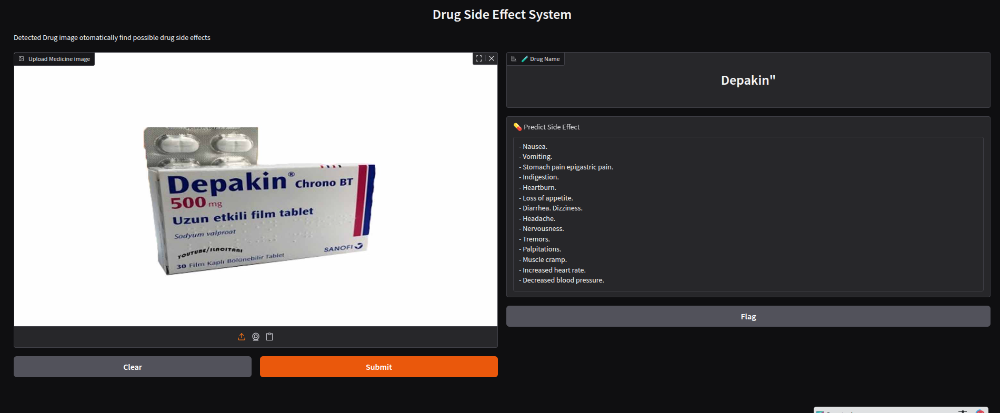

# 💊 Drug Side Effect Detection System

This project is a computer vision and NLP-powered system that detects **drug names from images** and predicts **possible side effects** using a pretrained language model.

## 🔍 Overview

The system takes an image of a **medicine box or label**, extracts the drug name using **YOLOv8 object detection** and **OCR (EasyOCR)**, and then predicts side effects using a **Hugging Face transformer model**.

<p align="center">
  
</p>

---

## 🚀 Features

- 📸 Drug name detection from images using YOLOv8
- 🔠 Text extraction using EasyOCR
- 🧠 Side effect prediction using fine-tuned language model on HuggingFace
- 🎛️ Easy-to-use web interface with Gradio

---

## 🛠 Technologies Used

- Python
- [YOLOv8](https://docs.ultralytics.com/) (via `ultralytics`)
- [EasyOCR](https://github.com/JaidedAI/EasyOCR)
- [Transformers (Hugging Face)](https://huggingface.co/)
- Gradio (Web UI)
- OpenCV (image processing)
- PyTorch (model inference)

---

## 📦 Installation

### ⚙️ Requirements

- Python 3.8+
- CUDA GPU (optional but recommended)

### 🧪 Setup

```bash
git clone https://github.com/Aghefendi/Side-Effect.git
cd Side-Effect

# Install dependencies
pip install -r requirements.txt
```
## Contributors

- Mehmet Agah Cicek (LLM Development)
- Bilal Berek (YOLO MODEL)
